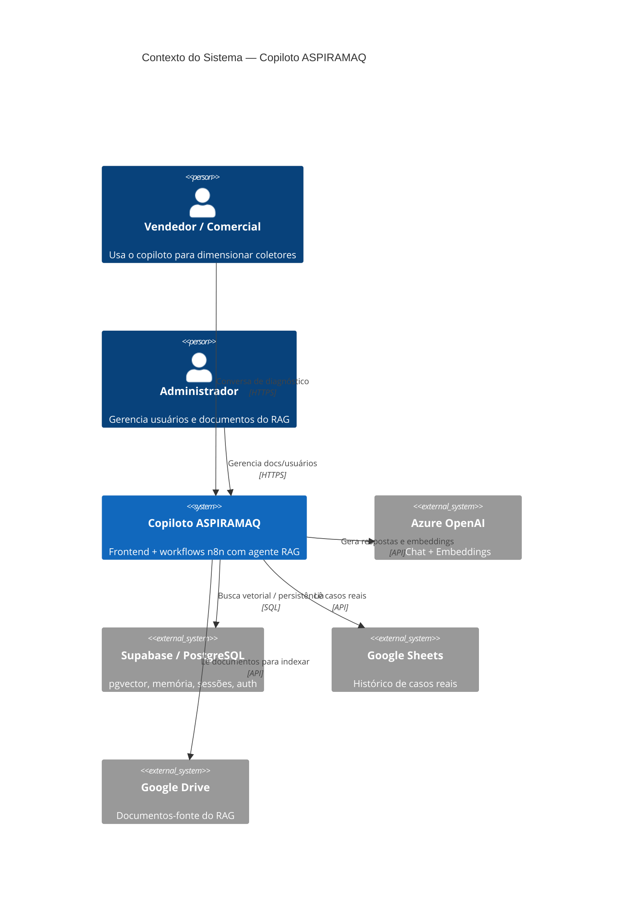
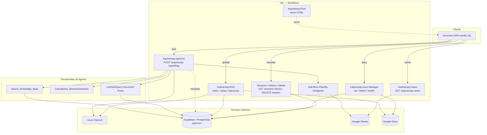
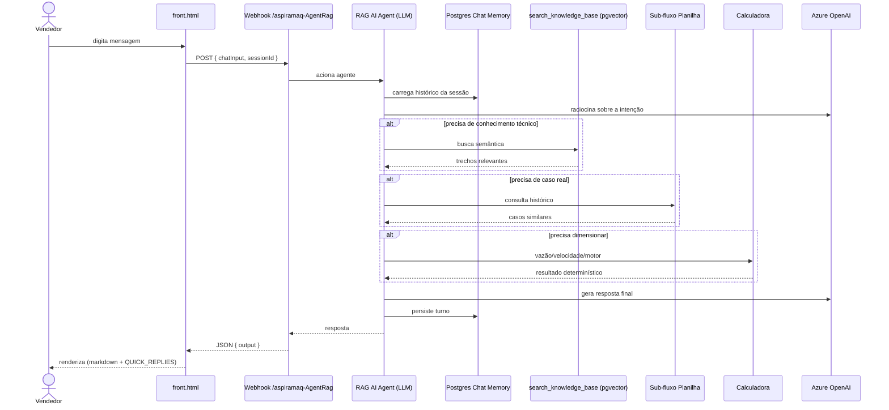
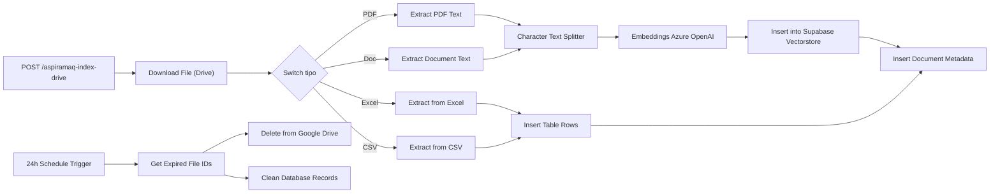

# Arquitetura — Copiloto Técnico-Comercial ASPIRAMAQ

## Padrão Arquitetural

O sistema segue um padrão de **orquestração por workflows + RAG (Retrieval-Augmented Generation)**, com o n8n como backend low-code. Cada responsabilidade (chat, sessões, ingestão de documentos, casos, gestão) é um workflow independente exposto por webhook. O frontend é uma SPA de arquivo único que conversa exclusivamente por HTTP com esses webhooks.

Características:

- **Sem servidor de aplicação tradicional:** a lógica vive em nós de workflow do n8n.
- **Agente com ferramentas:** o LLM (Azure OpenAI) decide quando chamar RAG, histórico de casos e a calculadora determinística.
- **Estado externo:** memória de chat, sessões e vetores ficam no PostgreSQL/Supabase; o histórico de casos no Google Sheets; documentos no Google Drive.
- **Conhecimento versionado em Markdown:** prompt e base de conhecimento são arquivos de repositório sincronizados para dentro dos workflows.

## Diagrama de Contexto (C4 — Nível 1)

## Diagrama de Componentes

## Fluxo de Requisição — Chat

Sequência de uma mensagem de diagnóstico enviada pelo vendedor:

## Fluxo de Ingestão — RAG

## Entidades de Dados

| Entidade                     | Onde vive                         | Conteúdo                                     |
| ---------------------------- | --------------------------------- | -------------------------------------------- |
| Mensagens de chat            | PostgreSQL (Postgres Chat Memory) | Turnos por `sessionId`                       |
| Sessões                      | PostgreSQL                        | Sessões de conversa, listagem/exclusão       |
| Vetores de conhecimento      | PostgreSQL (pgvector)             | Chunks + embeddings dos documentos           |
| Metadados de documentos      | PostgreSQL                        | Arquivos indexados, origem no Drive          |
| Linhas tabulares (Excel/CSV) | PostgreSQL                        | Dados de planilhas para consulta estruturada |
| Casos reais                  | Google Sheets                     | Abas `historico` e `Respostas ao formulário` |
| Documentos-fonte             | Google Drive                      | PDFs/Docs/planilhas originais                |
| Usuários / papéis            | PostgreSQL (auth + RPCs)          | Admin/viewer via `migrations/*.sql`          |

## Autenticação e Autorização

A autenticação usa **Supabase Auth**, com operações administrativas expostas por funções `SECURITY DEFINER` (prefixo `sameka_`), evoluídas pelas migrations:

- `sameka_is_admin()` — guarda de papel.
- `sameka_admin_list_users()`, `sameka_admin_confirm_user()`, `sameka_admin_update_user()`, `sameka_admin_delete_user()` — CRUD administrativo de usuários.
- Papéis (admin/viewer) em `002_add_roles.sql`; guardas administrativas em `003_admin_guards.sql`; proteção contra auto-exclusão em `006_prevent_self_delete.sql`.

As RPCs verificam o papel do chamador antes de qualquer mutação, evitando escalonamento de privilégios via cliente.

## Decisões de Arquitetura (ADRs)

### ADR-001 — Orquestração por n8n em vez de backend dedicado

**Contexto:** equipe pequena, necessidade de iterar rápido sobre integrações (Azure, Google, Supabase).
**Decisão:** usar n8n como camada de orquestração; lógica em workflows versionados como JSON.
**Consequências:** time-to-market baixo e integrações visuais; em troca, lógica acoplada ao n8n e necessidade de sincronizar prompt/front manualmente para dentro dos JSONs.

### ADR-002 — RAG com pgvector no Supabase

**Contexto:** conhecimento técnico extenso (catálogo, mídias, casos) que não cabe no prompt.
**Decisão:** indexar documentos via embeddings Azure OpenAI no `pgvector`, recuperando trechos sob demanda.
**Consequências:** respostas ancoradas em fontes reais; exige pipeline de ingestão e expiração de documentos.

### ADR-003 — Coleta conversacional em vez de formulários obrigatórios

**Contexto:** formulários multi-etapa engessavam a conversa e geravam abandono.
**Decisão:** o agente pergunta por **texto** apenas o que falta (1–3 perguntas); o formulário guiado só aparece via botão "Ajuda com caso novo".
**Consequências:** experiência mais natural; exige roteamento por intenção bem definido no prompt.

### ADR-004 — ATEX por exceção

**Contexto:** perguntar ATEX a todos atritava cenários sem risco.
**Decisão:** não perguntar ATEX por padrão; alertar automaticamente quando o material/histórico indicar pó combustível e bloquear/escalar apenas em risco confirmado.
**Consequências:** menos fricção sem perder segurança; depende de lista de materiais combustíveis e marcação no histórico.

### ADR-005 — Calculadora determinística como ferramenta

**Contexto:** cálculos aeráulicos não podem depender de "alucinação" do LLM.
**Decisão:** isolar vazão, velocidade, perda de carga e motor em código JavaScript determinístico exposto como ferramenta do agente.
**Consequências:** números reprodutíveis e auditáveis; o LLM interpreta, não calcula.

## Segurança

- **Segredos** ficam nas credenciais do n8n e no Supabase, nunca no repositório.
- **Autorização** administrativa centralizada em RPCs `SECURITY DEFINER` que checam papel.
- **Escalonamento de risco:** cenários ATEX confirmados são bloqueados e encaminhados ao especialista, evitando recomendação automática indevida.
- **Superfície de API** limitada a webhooks n8n; o front não acessa Supabase/Google diretamente.

## Performance

- **Memória de chat por sessão** evita reprocessar todo o histórico a cada turno.
- **Poda de histórico** (`/aspiramaq-prune-history`) ao editar mensagens mantém o contexto enxuto.
- **Busca vetorial** recupera apenas os chunks relevantes em vez de injetar a base inteira no prompt.
- **Expiração agendada (24h)** remove documentos vencidos do Drive e do banco, controlando o crescimento do índice.
- **Sub-fluxo de planilha** usa busca por substring de uma palavra para respostas rápidas sobre casos.

## Referências

- Racional do prompt v2 e modos de falha corrigidos: [DIAGNOSTICO_FLUXO.md](DIAGNOSTICO_FLUXO.md)
- System prompt: [prompt_v2.md](prompt_v2.md)
- Base de conhecimento: [base_conhecimento_aspiramaq.md](base_conhecimento_aspiramaq.md)
- Visão geral e setup: [README.md](README.md)
